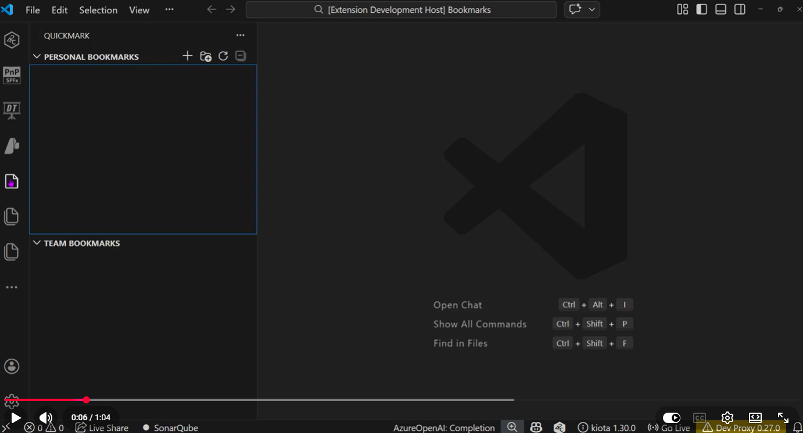

# QuickMark

> Bookmark manager for VS Code — store, organize, and share project bookmarks (files & URLs) with your team, right from the editor.

## Overview

[](https://youtu.be/yVEOKb1dW2s)

## Why QuickMark?

Every project has dependencies beyond code: task lists, project management tools, documentation portals, CI/CD dashboards, design systems, and more. Typically you share these links via READMEs, wikis, or chat pinned messages — forcing context switches to the browser.

**QuickMark** brings those bookmarks directly into VS Code. Add a file or URL, organize them into groups, and open them instantly — no browser bookmark hunting required.

## Features

| Feature | Description |
|---|---|
| **Add files or URLs** | Bookmark workspace files (opens in editor) or external URLs (opens in browser). |
| **Personal & Team bookmarks** | Personal bookmarks live in VS Code settings (`.vscode/settings.json` or global). Team bookmarks live in a committed `QuickMark.json` at the project root — perfect for sharing via source control. |
| **Groups** | Organize bookmarks into named groups. |
| **Deleted file detection** | If a bookmarked file is deleted from disk, it automatically appears in a "Deleted Files" group. |
| **Search** | Fuzzy-search across all bookmarks (personal + team) via the Command Palette. |
| **Move between storages** | Easily move a bookmark from Personal ↔ Team. |
| **Explorer integration** | Right-click any file in the Explorer → *Add to QuickMark*. |

## Getting Started

1. Install the extension.
2. Click the **QuickMark** icon in the Activity Bar (left sidebar).
3. Use the **+** button in either the Personal or Team tree view to add your first bookmark.
4. Or right-click any file in the Explorer → **Add to QuickMark**.

## Commands

All commands are available via **Ctrl+Shift+P** (or **Cmd+Shift+P** on macOS):

| Command | Description |
|---|---|
| `QuickMark: Add Bookmark` | Add a file or URL bookmark |
| `QuickMark: Search Bookmarks` | Fuzzy-search all bookmarks |
| `QuickMark: Create Group` | Create a new bookmark group |

## Storage

### Personal Bookmarks
Stored in VS Code settings. By default uses workspace settings (`.vscode/settings.json`). Change to global user settings via:

```json
"quickmark.personalStorageScope": "global"
```

### Team Bookmarks
Stored in `QuickMark.json` at the workspace root. Commit this file to source control so your team can use the same bookmarks.

## Settings

| Setting | Default | Description |
|---|---|---|
| `quickmark.personalStorageScope` | `"workspace"` | Where to store personal bookmarks: `"workspace"` or `"global"`. |

## Development

```bash
npm install
npm run build    # one-shot build
npm run watch    # watch mode
# Press F5 in VS Code to launch the Extension Development Host
```

## License

MIT
